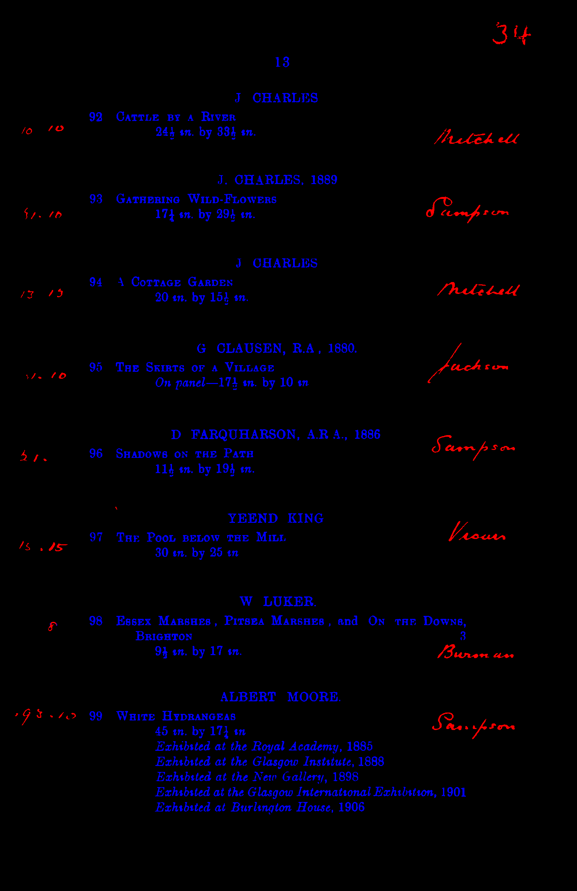
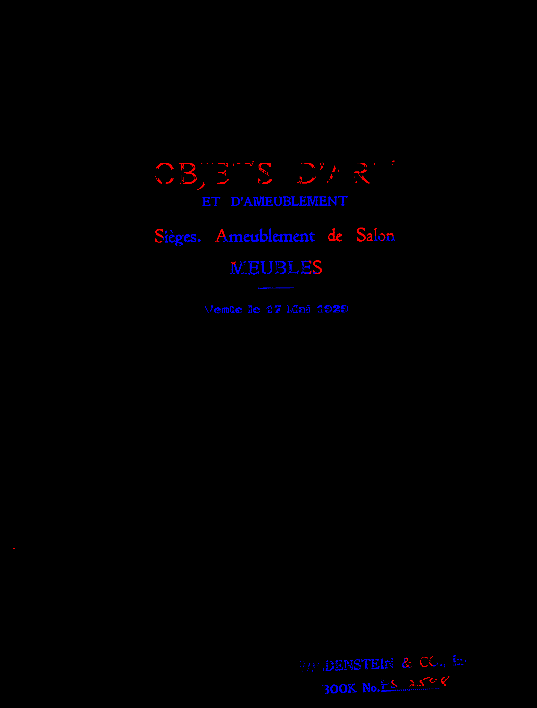

# RLPR - Synthesis in Style: Semantic Segmentation of Historical Documents using Synthetic Data #21
* [github issue](https://github.com/RLPR/LabelReviews/issues/21)
* [github repo](https://github.com/hendraet/synthesis-in-style)
* [paper](https://arxiv.org/pdf/2107.06777.pdf)

###  Results that can be reproduced

1. 🔴 Train a StyleGAN model.  
🚧 The original dataset is not publicly available.
2. 🔲 Use the model to create synthetic data using either our approach or DatasetGAN
3. 🔲 Train segmentation models on the synthetic data
4. ✅ Evaluate the results

#### ✅ Tables I - VI
Tables I - III are short version of tables IV - V.
During the review, we found errors in the tables values, the authors corrected the errors in the v3 version.
<details>
  <summary>v2 errors</summary>


| **in-domain - ours - TransUNet** | min_confidence | min_contour_area | patch_overlap | dice_weighted_avg | dice_weighted_text_avg | dice_background | dice_printed_text | dice_handwritten_text | iou_weighted_avg | iou_weighted_text_avg | iou_background | iou_printed_text | iou_handwritten_text | precision_weighted_avg | precision_weighted_text_avg | precision_background | precision_printed_text | precision_handwritten_text | recall_weighted_avg | recall_weighted_text_avg | recall_background | recall_printed_text | recall_handwritten_text |
|---:|-----------------:|-------------------:|----------------:|--------------------:|-------------------------:|------------------:|--------------------:|------------------------:|-------------------:|------------------------:|-----------------:|-------------------:|-----------------------:|-------------------------:|------------------------------:|-----------------------:|-------------------------:|-----------------------------:|----------------------:|---------------------------:|--------------------:|----------------------:|--------------------------:|
| paper | 0.9 | 15 | 0.5 | 0.996268 | 0.821749 | 0.998238 | 0.833186 | 0.632954 | 0.72452 | 0.699729 | 0.996482 | 0.714069 | 0.463008 | 0.996241 | 0.833212 | 0.99808 | 0.842972 | 0.672105 | 0.996301 | 0.810744 | 0.998395 | 0.823625 | 0.598112 |


| **out-domain - ours - TransUNet** | min_confidence | min_contour_area | patch_overlap | dice_weighted_avg | dice_weighted_text_avg | dice_background | dice_printed_text | dice_handwritten_text | iou_weighted_avg | iou_weighted_text_avg | iou_background | iou_printed_text | iou_handwritten_text | precision_weighted_avg | precision_weighted_text_avg | precision_background | precision_printed_text | precision_handwritten_text | recall_weighted_avg | recall_weighted_text_avg | recall_background | recall_printed_text | recall_handwritten_text |
|---:|-----------------:|-------------------:|----------------:|--------------------:|-------------------------:|------------------:|--------------------:|------------------------:|-------------------:|------------------------:|-----------------:|-------------------:|-----------------------:|-------------------------:|------------------------------:|-----------------------:|-------------------------:|-----------------------------:|----------------------:|---------------------------:|--------------------:|----------------------:|--------------------------:|
| paper | 0.9 | 15 | 0.5 | 0.981201 | 0.573953 | 0.992346 | 0.635311 | 0.294833 | 0.541083 | 0.4128 | 0.984809 | 0.465536 | 0.172905 | 0.981267 | 0.778647 | 0.986812 | 0.865515 | 0.383484 | 0.983468 | 0.454556 | 0.997943 | 0.501837 | 0.239473 |

</details>

#### ✅ Figures 3 - 7
Figure 3 = Figure 4

| fig 4 | fig 5 | fig 6 | fig 7 |
| ----- | ----- | ----- | ----- |
|  |  |  | 

### Get the code and data
```
git clone git@github.com:hendraet/synthesis-in-style.git
```

The trained models and benchmark dataset used for evaluation can be found here : [https://bartzi.de/research/synthesis_in_style](https://bartzi.de/research/synthesis_in_style)
```
wget https://bartzi.de/documents/attachment/download\?hash_value\=930173d8e073227e1845b4dea8abfc0c_57 -O benchmark_dataset.zip
wget https://bartzi.de/documents/attachment/download\?hash_value\=dd15bbce1b42200ed347ecc3ab98993b_66 -O sis_swagan.tar.gz
wget https://bartzi.de/documents/attachment/download\?hash_value\=9ccec0a8c423832554a2c4babc9679d4_67 -O sis_stylegan.tar.gz
wget https://bartzi.de/documents/attachment/download?hash_value=1c52f3da5539c3b2be134f2f6d6753d2_68 -O datasetgan_swagan.tar.gz
wget https://bartzi.de/documents/attachment/download?hash_value=b6d671c7fb5e625cacbc10509789498c_69 -O datasetgan_stylegan.tar.gz
wget https://bartzi.de/documents/attachment/download?hash_value=52c89c982dc413cf16daa042844d93e7_70 -O stylegan_model.tar.gz
```

```
unzip benchmark_dataset.zip
7z x -so sis_swagan.tar.gz | 7z x -si -ttar
7z x -so sis_stylegan.tar.gz | 7z x -si -ttar
7z x -so datasetgan_swagan.tar.gz | 7z x -si -ttar
7z x -so datasetgan_stylegan.tar.gz | 7z x -si -ttar
7z x -so stylegan_model.tar.gz | 7z x -si -ttar
```

### Using the provided docker image

```
# pull docker
docker pull hendraet/synthesis-in-style:cuda-11.1
# test docker work with gpu
docker run -it --rm --gpus all hendraet/synthesis-in-style:cuda-11.1
python3.8 # python = 2.7.18, python3.8 = 3.8.10
```

```
>>> import torch
>>> torch.version.cuda
'11.1'
>>> torch.cuda.is_available()
True
>>> torch.cuda.device_count()
2
>>> torch.cuda.current_device()
0
>>> torch.cuda.get_device_name(0)
'NVIDIA GeForce RTX 2080 Ti'
```

### Evaluate provided segmentation models
Create config file

*trans_u_net*
```
vim synthesis-in-style/stylegan_code_finder/configs/evaluation/sis_stylegan_config.json
```
```
{
  "checkpoint": "/rlpr/sis_stylegan/trans_u_net.pt",
  "class_to_color_map": "handwriting_colors.json",
  "max_image_size": 0
}
```
```
vim synthesis-in-style/stylegan_code_finder/configs/evaluation/datasetgan_stylegan_config.json
```
```
{
  "checkpoint": "/rlpr/datasetgan_stylegan/trans_u_net.pt",
  "class_to_color_map": "handwriting_colors.json",
  "max_image_size": 0
}
```

*Doc-UFCN*
```
vim synthesis-in-style/stylegan_code_finder/configs/evaluation/sis_stylegan_ufcn_config.json
```
```
{
  "checkpoint": "/rlpr/sis_stylegan/doc_ufcn.pt",
  "class_to_color_map": "handwriting_colors.json",
  "max_image_size": 0
}
```
```
vim synthesis-in-style/stylegan_code_finder/configs/evaluation/datasetgan_stylegan_ufcn_config.json
```
```
{
  "checkpoint": "/rlpr/datasetgan_stylegan/doc_ufcn.pt",
  "class_to_color_map": "handwriting_colors.json",
  "max_image_size": 0
}
```

*EMANet*
```
vim synthesis-in-style/stylegan_code_finder/configs/evaluation/sis_stylegan_emanet_config.json
```
```
{
  "checkpoint": "/rlpr/sis_stylegan/ema_net.pt",
  "class_to_color_map": "handwriting_colors.json",
  "max_image_size": 0
}
```
```
vim synthesis-in-style/stylegan_code_finder/configs/evaluation/datasetgan_stylegan_emanet_config.json
```
```
{
  "checkpoint": "/rlpr/datasetgan_stylegan/ema_net.pt",
  "class_to_color_map": "handwriting_colors.json",
  "max_image_size": 0
}
```

Create result folder
```
# replace "/home/cyril/Development/RLPR" with "$(pwd)"
docker run -v /home/cyril/Development/RLPR:/rlpr -it --rm --gpus all hendraet/synthesis-in-style:cuda-11.1
```

```
cd /rlpr/synthesis-in-style/stylegan_code_finder/ 
```

*trans_u_net*

```
PYTHONPATH='.' python3.8 ./segmentation/evaluation/analyze_image_segments.py \
  /rlpr/benchmark_dataset/original \
  -gt /rlpr/benchmark_dataset/ground_truth \
  --config-file /rlpr/synthesis-in-style/stylegan_code_finder/configs/evaluation/sis_stylegan_config.json \
  --original-config-path /rlpr/synthesis-in-style/stylegan_code_finder/configs/segmenter/stylegan2_trans_u_net_segmenter.yaml \
  --output-dir /rlpr/out_sis_stylegan \
  -bw \
  --patch-overlap-factor 0.50 0.0 \
  --min-confidence 0.3 0.7 0.9 \
  --min-contour-area 15 30 55 \
  -cds -cre -cpr -cio \
  -vis
```

```
PYTHONPATH='.' python3.8 ./segmentation/evaluation/analyze_image_segments.py \
  /rlpr/benchmark_dataset/original \
  -gt /rlpr/benchmark_dataset/ground_truth \
  --config-file /rlpr/synthesis-in-style/stylegan_code_finder/configs/evaluation/datasetgan_stylegan_config.json \
  --original-config-path /rlpr/synthesis-in-style/stylegan_code_finder/configs/segmenter/stylegan2_trans_u_net_segmenter.yaml \
  --output-dir /rlpr/out_datasetgan_stylegan \
  -bw \
  --patch-overlap-factor 0.50 0.0 \
  --min-confidence 0.3 0.7 0.9 \
  --min-contour-area 15 30 55 \
  -cds -cre -cpr -cio \
  -vis
```

*Doc-UFCN*
```
PYTHONPATH='.' python3.8 ./segmentation/evaluation/analyze_image_segments.py \
  /rlpr/benchmark_dataset/original \
  -gt /rlpr/benchmark_dataset/ground_truth \
  --config-file /rlpr/synthesis-in-style/stylegan_code_finder/configs/evaluation/sis_stylegan_ufcn_config.json \
  --original-config-path /rlpr/synthesis-in-style/stylegan_code_finder/configs/segmenter/stylegan2_doc_ufcn_segmenter.yaml \
  --output-dir /rlpr/out_sis_stylegan_ufcn \
  -bw \
  --patch-overlap-factor 0.50 0.0 \
  --min-confidence 0.3 0.7 0.9 \
  --min-contour-area 15 30 55 \
  -cds -cre -cpr -cio \
  -vis

PYTHONPATH='.' python3.8 ./segmentation/evaluation/analyze_image_segments.py \
  /rlpr/benchmark_dataset/original \
  -gt /rlpr/benchmark_dataset/ground_truth \
  --config-file /rlpr/synthesis-in-style/stylegan_code_finder/configs/evaluation/datasetgan_stylegan_ufcn_config.json \
  --original-config-path /rlpr/synthesis-in-style/stylegan_code_finder/configs/segmenter/stylegan2_doc_ufcn_segmenter.yaml \
  --output-dir /rlpr/out_datasetgan_stylegan_ufcn \
  -bw \
  --patch-overlap-factor 0.50 0.0 \
  --min-confidence 0.3 0.7 0.9 \
  --min-contour-area 15 30 55 \
  -cds -cre -cpr -cio \
  -vis
```

*EMANet*
```
PYTHONPATH='.' python3.8 ./segmentation/evaluation/analyze_image_segments.py \
  /rlpr/benchmark_dataset/original \
  -gt /rlpr/benchmark_dataset/ground_truth \
  --config-file /rlpr/synthesis-in-style/stylegan_code_finder/configs/evaluation/sis_stylegan_emanet_config.json \
  --original-config-path /rlpr/synthesis-in-style/stylegan_code_finder/configs/segmenter/stylegan2_ema_net_segmenter.yaml \
  --output-dir /rlpr/out_sis_stylegan_emanet \
  -bw \
  --patch-overlap-factor 0.50 0.0 \
  --min-confidence 0.3 0.7 0.9 \
  --min-contour-area 15 30 55 \
  -cds -cre -cpr -cio \
  -vis

PYTHONPATH='.' python3.8 ./segmentation/evaluation/analyze_image_segments.py \
  /rlpr/benchmark_dataset/original \
  -gt /rlpr/benchmark_dataset/ground_truth \
  --config-file /rlpr/synthesis-in-style/stylegan_code_finder/configs/evaluation/datasetgan_stylegan_emanet_config.json \
  --original-config-path /rlpr/synthesis-in-style/stylegan_code_finder/configs/segmenter/stylegan2_ema_net_segmenter.yaml \
  --output-dir /rlpr/out_datasetgan_stylegan_emanet \
  -bw \
  --patch-overlap-factor 0.50 0.0 \
  --min-confidence 0.3 0.7 0.9 \
  --min-contour-area 15 30 55 \
  -cds -cre -cpr -cio \
  -vis
```
 
Extract result and print metrics
```
# in-domain - ours - TransUNet
PYTHONPATH='.' python3.8 ./segmentation/evaluation/extract_results_subset.py /rlpr/out_sis_stylegan/results.json /rlpr/benchmark_dataset/in-domain-images.txt /rlpr/out_sis_stylegan/results_in-domain-images.json
# check post-processing hyperparameters values
PYTHONPATH='.' python3.8 ./segmentation/evaluation/evaluate_metrics.py /rlpr/out_sis_stylegan/results_in-domain-images.json -c -p
# check score values
PYTHONPATH='.' python3.8 ./segmentation/evaluation/evaluate_metrics.py /rlpr/out_sis_stylegan/results_in-domain-images.json -c -r min_confidence 0.9 min_contour_area 15 patch_overlap 0.5
```
|    |   min_confidence |   min_contour_area |   patch_overlap |   dice_weighted_avg |   dice_weighted_text_avg |   dice_background |   dice_printed_text |   dice_handwritten_text |   iou_weighted_avg |   iou_weighted_text_avg |   iou_background |   iou_printed_text |   iou_handwritten_text |   precision_weighted_avg |   precision_weighted_text_avg |   precision_background |   precision_printed_text |   precision_handwritten_text |   recall_weighted_avg |   recall_weighted_text_avg |   recall_background |   recall_printed_text |   recall_handwritten_text |
|---:|-----------------:|-------------------:|----------------:|--------------------:|-------------------------:|------------------:|--------------------:|------------------------:|-------------------:|------------------------:|-----------------:|-------------------:|-----------------------:|-------------------------:|------------------------------:|-----------------------:|-------------------------:|-----------------------------:|----------------------:|---------------------------:|--------------------:|----------------------:|--------------------------:|
|  0 |              0.9 |                 15 |             0.5 |            0.996268 |                 0.821749 |          0.998238 |            0.833186 |                0.632954 |            0.72452 |                0.699729 |         0.996482 |           0.714069 |               0.463008 |                 0.996241 |                      0.833212 |                0.99808 |                 0.842972 |                     0.672105 |              0.996301 |                   0.810744 |            0.998395 |              0.823625 |                  0.598112 |

```
# out-domain - ours - TransUNet
PYTHONPATH='.' python3.8 ./segmentation/evaluation/extract_results_subset.py /rlpr/out_sis_stylegan/results.json /rlpr/benchmark_dataset/out-of-domain-images.txt /rlpr/out_sis_stylegan/results_out-domain-images.json
# not same post process hyperparam
PYTHONPATH='.' python3.8 ./segmentation/evaluation/evaluate_metrics.py /rlpr/out_sis_stylegan/results_out-domain-images.json -c -p
# force post process hyperparam
PYTHONPATH='.' python3.8 ./segmentation/evaluation/evaluate_metrics.py /rlpr/out_sis_stylegan/results_out-domain-images.json -c -r min_confidence 0.9 min_contour_area 15 patch_overlap 0.5
```
|    |   min_confidence |   min_contour_area |   patch_overlap |   dice_weighted_avg |   dice_weighted_text_avg |   dice_background |   dice_printed_text |   dice_handwritten_text |   iou_weighted_avg |   iou_weighted_text_avg |   iou_background |   iou_printed_text |   iou_handwritten_text |   precision_weighted_avg |   precision_weighted_text_avg |   precision_background |   precision_printed_text |   precision_handwritten_text |   recall_weighted_avg |   recall_weighted_text_avg |   recall_background |   recall_printed_text |   recall_handwritten_text |
|---:|-----------------:|-------------------:|----------------:|--------------------:|-------------------------:|------------------:|--------------------:|------------------------:|-------------------:|------------------------:|-----------------:|-------------------:|-----------------------:|-------------------------:|------------------------------:|-----------------------:|-------------------------:|-----------------------------:|----------------------:|---------------------------:|--------------------:|----------------------:|--------------------------:|
|  0 |              0.9 |                 15 |             0.5 |            0.981201 |                 0.573953 |          0.992346 |            0.635311 |                0.294833 |           0.541083 |                  0.4128 |         0.984809 |           0.465536 |               0.172905 |                 0.981267 |                      0.778647 |               0.986812 |                 0.865515 |                     0.383484 |              0.983468 |                   0.454556 |            0.997943 |              0.501837 |                  0.239473 |

```
# in-domain - DatasetGAN - TransUNet
PYTHONPATH='.' python3.8 ./segmentation/evaluation/extract_results_subset.py /rlpr/out_datasetgan_stylegan/results.json /rlpr/benchmark_dataset/in-domain-images.txt /rlpr/out_datasetgan_stylegan/results_in-domain-images.json
PYTHONPATH='.' python3.8 ./segmentation/evaluation/evaluate_metrics.py /rlpr/out_datasetgan_stylegan/results_in-domain-images.json -c -p
PYTHONPATH='.' python3.8 ./segmentation/evaluation/evaluate_metrics.py /rlpr/out_datasetgan_stylegan/results_in-domain-images.json -c -r min_confidence 0.7 min_contour_area 55 patch_overlap 0.5
```
|    |   min_confidence |   min_contour_area |   patch_overlap |   dice_weighted_avg |   dice_weighted_text_avg |   dice_background |   dice_printed_text |   dice_handwritten_text |   iou_weighted_avg |   iou_weighted_text_avg |   iou_background |   iou_printed_text |   iou_handwritten_text |   precision_weighted_avg |   precision_weighted_text_avg |   precision_background |   precision_printed_text |   precision_handwritten_text |   recall_weighted_avg |   recall_weighted_text_avg |   recall_background |   recall_printed_text |   recall_handwritten_text |
|---:|-----------------:|-------------------:|----------------:|--------------------:|-------------------------:|------------------:|--------------------:|------------------------:|-------------------:|------------------------:|-----------------:|-------------------:|-----------------------:|-------------------------:|------------------------------:|-----------------------:|-------------------------:|-----------------------------:|----------------------:|---------------------------:|--------------------:|----------------------:|--------------------------:|
|  0 |              0.7 |                 55 |             0.5 |            0.994908 |                 0.735855 |          0.997831 |            0.757059 |                0.385834 |           0.614596 |                 0.58795 |         0.995671 |           0.609087 |                0.23903 |                  0.99506 |                      0.800846 |               0.997252 |                 0.831562 |                     0.293815 |              0.994938 |                    0.68721 |             0.99841 |              0.694808 |                  0.561774 |

```
# out-domain - DatasetGAN - TransUNet
PYTHONPATH='.' python3.8 ./segmentation/evaluation/extract_results_subset.py /rlpr/out_datasetgan_stylegan/results.json /rlpr/benchmark_dataset/out-of-domain-images.txt /rlpr/out_datasetgan_stylegan/results_out-domain-images.json
PYTHONPATH='.' python3.8 ./segmentation/evaluation/evaluate_metrics.py /rlpr/out_datasetgan_stylegan/results_out-domain-images.json -c -p
PYTHONPATH='.' python3.8 ./segmentation/evaluation/evaluate_metrics.py /rlpr/out_datasetgan_stylegan/results_out-domain-images.json -c -r min_confidence 0.7 min_contour_area 55 patch_overlap 0.5
```
|    |   min_confidence |   min_contour_area |   patch_overlap |   dice_weighted_avg |   dice_weighted_text_avg |   dice_background |   dice_printed_text |   dice_handwritten_text |   iou_weighted_avg |   iou_weighted_text_avg |   iou_background |   iou_printed_text |   iou_handwritten_text |   precision_weighted_avg |   precision_weighted_text_avg |   precision_background |   precision_printed_text |   precision_handwritten_text |   recall_weighted_avg |   recall_weighted_text_avg |   recall_background |   recall_printed_text |   recall_handwritten_text |
|---:|-----------------:|-------------------:|----------------:|--------------------:|-------------------------:|------------------:|--------------------:|------------------------:|-------------------:|------------------------:|-----------------:|-------------------:|-----------------------:|-------------------------:|------------------------------:|-----------------------:|-------------------------:|-----------------------------:|----------------------:|---------------------------:|--------------------:|----------------------:|--------------------------:|
|  0 |              0.7 |                 55 |             0.5 |            0.977312 |                 0.452578 |          0.991673 |            0.503234 |                0.222141 |           0.481549 |                0.298142 |         0.983483 |           0.336214 |               0.124948 |                 0.978855 |                      0.748133 |               0.985169 |                 0.863337 |                     0.224066 |              0.980483 |                    0.33081 |            0.998263 |              0.355114 |                  0.220248 |

```
# in-domain - ours - DocUFCN
PYTHONPATH='.' python3.8 ./segmentation/evaluation/extract_results_subset.py /rlpr/out_sis_stylegan_ufcn/results.json /rlpr/benchmark_dataset/in-domain-images.txt /rlpr/out_sis_stylegan_ufcn/results_in-domain-images.json
PYTHONPATH='.' python3.8 ./segmentation/evaluation/evaluate_metrics.py /rlpr/out_sis_stylegan_ufcn/results_in-domain-images.json -c -p
PYTHONPATH='.' python3.8 ./segmentation/evaluation/evaluate_metrics.py /rlpr/out_sis_stylegan_ufcn/results_in-domain-images.json -c -r min_confidence 0.3 min_contour_area 15 patch_overlap 0.5

# out-domain - ours - DocUFCN
PYTHONPATH='.' python3.8 ./segmentation/evaluation/extract_results_subset.py /rlpr/out_sis_stylegan_ufcn/results.json /rlpr/benchmark_dataset/out-of-domain-images.txt /rlpr/out_sis_stylegan_ufcn/results_out-domain-images.json
PYTHONPATH='.' python3.8 ./segmentation/evaluation/evaluate_metrics.py /rlpr/out_sis_stylegan_ufcn/results_out-domain-images.json -c -r min_confidence 0.3 min_contour_area 15 patch_overlap 0.5

# in-domain - DatasetGAN - DocUFCN
PYTHONPATH='.' python3.8 ./segmentation/evaluation/extract_results_subset.py /rlpr/out_datasetgan_stylegan_ufcn/results.json /rlpr/benchmark_dataset/in-domain-images.txt /rlpr/out_datasetgan_stylegan_ufcn/results_in-domain-images.json
PYTHONPATH='.' python3.8 ./segmentation/evaluation/evaluate_metrics.py /rlpr/out_datasetgan_stylegan_ufcn/results_in-domain-images.json -c -p
PYTHONPATH='.' python3.8 ./segmentation/evaluation/evaluate_metrics.py /rlpr/out_datasetgan_stylegan_ufcn/results_in-domain-images.json -c -r min_confidence 0.3 min_contour_area 15 patch_overlap 0

# out-domain - DatasetGAN - DocUFCN
PYTHONPATH='.' python3.8 ./segmentation/evaluation/extract_results_subset.py /rlpr/out_datasetgan_stylegan_ufcn/results.json /rlpr/benchmark_dataset/out-of-domain-images.txt /rlpr/out_datasetgan_stylegan_ufcn/results_out-domain-images.json
PYTHONPATH='.' python3.8 ./segmentation/evaluation/evaluate_metrics.py /rlpr/out_datasetgan_stylegan_ufcn/results_out-domain-images.json -c -r min_confidence 0.3 min_contour_area 15 patch_overlap 0
```
|    |   min_confidence |   min_contour_area |   patch_overlap |   dice_weighted_avg |   dice_weighted_text_avg |   dice_background |   dice_printed_text |   dice_handwritten_text |   iou_weighted_avg |   iou_weighted_text_avg |   iou_background |   iou_printed_text |   iou_handwritten_text |   precision_weighted_avg |   precision_weighted_text_avg |   precision_background |   precision_printed_text |   precision_handwritten_text |   recall_weighted_avg |   recall_weighted_text_avg |   recall_background |   recall_printed_text |   recall_handwritten_text |
|---:|-----------------:|-------------------:|----------------:|--------------------:|-------------------------:|------------------:|--------------------:|------------------------:|-------------------:|------------------------:|-----------------:|-------------------:|-----------------------:|-------------------------:|------------------------------:|-----------------------:|-------------------------:|-----------------------------:|----------------------:|---------------------------:|--------------------:|----------------------:|--------------------------:|
|  0 |              0.3 |                 15 |             0.5 |            0.995627 |                 0.799051 |          0.997845 |            0.820852 |                0.439182 |           0.657739 |                0.672449 |         0.995699 |           0.696139 |               0.281379 |                  0.99592 |                      0.796339 |               0.998172 |                 0.825199 |                     0.319947 |              0.995425 |                   0.809898 |            0.997518 |               0.81655 |                  0.700081 |
|  0 |              0.3 |                 15 |             0.5 |            0.977673 |                 0.481646 |          0.991248 |            0.545311 |                0.192034 |           0.487909 |                0.326451 |         0.982647 |           0.374864 |               0.106215 |                 0.980357 |                      0.744998 |               0.986798 |                 0.874891 |                     0.154115 |              0.979086 |                   0.370616 |            0.995738 |              0.396097 |                  0.254702 |
|  0 |              0.3 |                 15 |               0 |            0.995054 |                 0.766436 |          0.997634 |            0.783077 |                0.491728 |            0.65493 |                0.625356 |         0.995279 |            0.64349 |                0.32602 |                 0.994961 |                      0.815628 |               0.996984 |                  0.82723 |                     0.624111 |              0.995225 |                   0.724109 |            0.998284 |              0.743399 |                  0.405677 |
|  0 |              0.3 |                 15 |               0 |            0.974935 |                 0.421994 |          0.990067 |            0.490402 |                0.110808 |           0.454613 |                0.276883 |          0.98033 |           0.324856 |              0.0586538 |                 0.974795 |                      0.704286 |               0.982198 |                  0.80184 |                     0.260512 |              0.979528 |                   0.302241 |            0.998063 |              0.353212 |                   0.07037 |


```
# in-domain - ours - EMANet
PYTHONPATH='.' python3.8 ./segmentation/evaluation/extract_results_subset.py /rlpr/out_sis_stylegan_emanet/results.json /rlpr/benchmark_dataset/in-domain-images.txt /rlpr/out_sis_stylegan_emanet/results_in-domain-images.json
PYTHONPATH='.' python3.8 ./segmentation/evaluation/evaluate_metrics.py /rlpr/out_sis_stylegan_emanet/results_in-domain-images.json -c -p
PYTHONPATH='.' python3.8 ./segmentation/evaluation/evaluate_metrics.py /rlpr/out_sis_stylegan_emanet/results_in-domain-images.json -c -r min_confidence 0.3 min_contour_area 15 patch_overlap 0.5

# out-domain - ours - EMANet
PYTHONPATH='.' python3.8 ./segmentation/evaluation/extract_results_subset.py /rlpr/out_sis_stylegan_emanet/results.json /rlpr/benchmark_dataset/out-of-domain-images.txt /rlpr/out_sis_stylegan_emanet/results_out-domain-images.json
PYTHONPATH='.' python3.8 ./segmentation/evaluation/evaluate_metrics.py /rlpr/out_sis_stylegan_emanet/results_out-domain-images.json -c -r min_confidence 0.3 min_contour_area 15 patch_overlap 0.5

# in-domain - DatasetGAN - EMANet
PYTHONPATH='.' python3.8 ./segmentation/evaluation/extract_results_subset.py /rlpr/out_datasetgan_stylegan_emanet/results.json /rlpr/benchmark_dataset/in-domain-images.txt /rlpr/out_datasetgan_stylegan_emanet/results_in-domain-images.json
PYTHONPATH='.' python3.8 ./segmentation/evaluation/evaluate_metrics.py /rlpr/out_datasetgan_stylegan_emanet/results_in-domain-images.json -c -p
PYTHONPATH='.' python3.8 ./segmentation/evaluation/evaluate_metrics.py /rlpr/out_datasetgan_stylegan_emanet/results_in-domain-images.json -c -r min_confidence 0.3 min_contour_area 15 patch_overlap 0.5

# out-domain - DatasetGAN - EMANet
PYTHONPATH='.' python3.8 ./segmentation/evaluation/extract_results_subset.py /rlpr/out_datasetgan_stylegan_emanet/results.json /rlpr/benchmark_dataset/out-of-domain-images.txt /rlpr/out_datasetgan_stylegan_emanet/results_out-domain-images.json
PYTHONPATH='.' python3.8 ./segmentation/evaluation/evaluate_metrics.py /rlpr/out_datasetgan_stylegan_emanet/results_out-domain-images.json -c -r min_confidence 0.3 min_contour_area 15 patch_overlap 0.5
```
|    |   min_confidence |   min_contour_area |   patch_overlap |   dice_weighted_avg |   dice_weighted_text_avg |   dice_background |   dice_printed_text |   dice_handwritten_text |   iou_weighted_avg |   iou_weighted_text_avg |   iou_background |   iou_printed_text |   iou_handwritten_text |   precision_weighted_avg |   precision_weighted_text_avg |   precision_background |   precision_printed_text |   precision_handwritten_text |   recall_weighted_avg |   recall_weighted_text_avg |   recall_background |   recall_printed_text |   recall_handwritten_text |
|---:|-----------------:|-------------------:|----------------:|--------------------:|-------------------------:|------------------:|--------------------:|------------------------:|-------------------:|------------------------:|-----------------:|-------------------:|-----------------------:|-------------------------:|------------------------------:|-----------------------:|-------------------------:|-----------------------------:|----------------------:|---------------------------:|--------------------:|----------------------:|--------------------------:|
|  0 |              0.3 |                 15 |             0.5 |            0.992045 |                  0.67958 |          0.995571 |            0.682592 |                0.629861 |            0.65634 |                0.514796 |          0.99118 |           0.518133 |               0.459705 |                 0.993704 |                      0.568045 |               0.998507 |                 0.559646 |                     0.706691 |              0.991141 |                   0.857249 |            0.992651 |              0.874765 |                  0.568098 |
|  0 |              0.3 |                 15 |             0.5 |            0.981118 |                 0.614261 |          0.991158 |            0.686475 |                 0.28576 |           0.557263 |                0.458479 |          0.98247 |            0.52262 |               0.166697 |                 0.981464 |                      0.601798 |               0.991854 |                 0.674714 |                     0.270097 |              0.980791 |                   0.627414 |            0.990462 |              0.698653 |                   0.30335 |
|  0 |              0.3 |                 15 |             0.5 |            0.989764 |                 0.466331 |          0.995671 |            0.469218 |                0.418662 |           0.520884 |                0.304136 |         0.991379 |           0.306522 |               0.264752 |                 0.989651 |                      0.689637 |               0.993037 |                 0.706662 |                     0.408598 |              0.991148 |                   0.355666 |            0.998319 |               0.35121 |                  0.429235 |
|  0 |              0.3 |                 15 |             0.5 |            0.972311 |                  0.34213 |          0.989558 |             0.38799 |                0.133512 |           0.430517 |                0.210203 |         0.979331 |           0.240687 |              0.0715312 |                 0.973992 |                      0.726767 |               0.980758 |                 0.843593 |                     0.195321 |              0.977906 |                   0.224806 |            0.998516 |               0.25193 |                  0.101419 |

### Evaluate newly trained segmentation models

```
docker run -v $(pwd):/rlpr -it --rm --gpus all hendraet/synthesis-in-style:cuda-11.1
```

1. 🔴 Train StyleGAN2

2. Create Synthetic Data using paper approach

```
cd /rlpr/synthesis-in-style/stylegan_code_finder/
```

**Create a Segmentation**

```
python3 create_semantic_segmentation.py \
  /rlpr/stylegan2.pt \
  -c 20 24 \
  --destination /rlpr/out \
  --original-config-path /rlpr/synthesis-in-style/stylegan_code_finder/configs/stylegan/stylegan_256px_original_config.yaml
```

using the docker image, we got a the following warning :
`OpenBLAS Warning : Detect OpenMP Loop and this application may hang. Please rebuild the library with USE_OPENMP=1 option.`

**🔴 Label Clusters**
```
docker run -v $(pwd):/rlpr -it --rm --gpus all -p 5000:5000 hendraet/synthesis-in-style:cuda-11.1
cd /rlpr/synthesis-in-style/semantic_labeller
flask run --host 0.0.0.0
```


**🔴 Create Dataset**

```
python3 create_dataset_for_segmentation.py \
  /rlpr/stylegan2.pt \
  configs/dataset_creation/stylegan2_cluster_based_bw_hwp_wpi.json \
  --num-clusters 20 \
  -s /rlpr/out \
  -b 8 \
  -n 100000
```

```
Traceback (most recent call last):
  File "create_dataset_for_segmentation.py", line 239, in <module>
    main(parsed_args)
  File "create_dataset_for_segmentation.py", line 179, in main
    build_dataset(args, config)
  File "create_dataset_for_segmentation.py", line 115, in build_dataset
    config = load_config(args.checkpoint, None)
  File "/rlpr/synthesis-in-style/stylegan_code_finder/utils/config.py", line 23, in load_config
    with open(original_config) as f:
FileNotFoundError: [Errno 2] No such file or directory: '/config/config.json'
```

3. Train a segmentation model

4. Evaluate


### Missing details
Using the provided docker :
* the default python is 2.7, you need to use python3 or python3.8
* you need to add PYTHONPATH='.' before python call to avoid import errors

**negligible errors**
* Table V | handwritten text | recall - ours - TransUNet - rounding error for 0.239473
